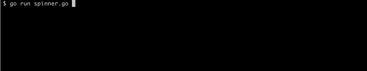

# golang-progress

## What?
It's a progress indicator for your terminal apps. In go.



## Why?

It's cute and better than a screen full of dots.

## How?

Trivially!

If you're cool with the custom animation you just call:

```golang
p := progress.NewSpinner()
p.Start("Some message")
```

If you want a custom animation that comes bundled with the backage then you
can:

```golang
p := progress.NewSpinnerWithFrames(progress.Animation["growVertical"])
p.Start("Your message")
```

When your command finishes just call `p.Stop()` or `p.Stopln()`

Demo code is available [here](./demo/spinner.go).
